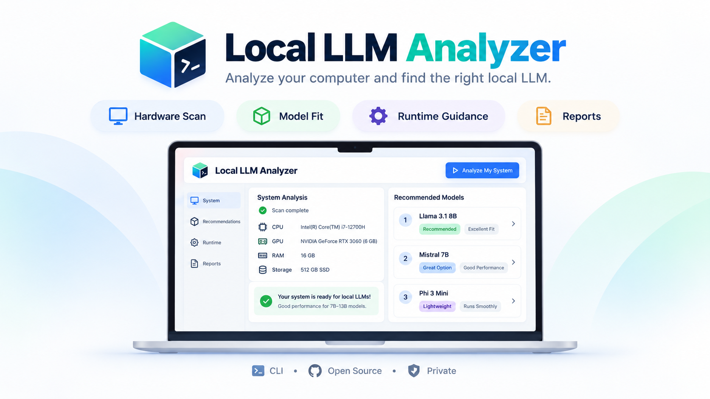

# Local LLM Analyzer



An offline, deterministic CLI that scans Windows 10/11 x64 hardware and explains which local model configurations are plausible. No LLM, model download, account, administrator access, or installed inference runtime is required.

Local LLM Analyzer performs hardware analysis locally and does not upload your hardware profile by default. Version 1 has no upload functionality or telemetry.

Current version: **0.1.0**. This release supports live hardware scanning on **Windows 10/11 x64** and ships as `llm-analyzer-windows-x64.exe`. Linux and macOS can use saved Windows scan files for deterministic recommendation analysis; native live scanners for those platforms are planned for a future release.

## Quick start

Requires Python 3.11+ on Windows x64 for live scanning. Core analysis also runs on other platforms using saved Windows scans.

```powershell
python -m venv .venv
.venv\Scripts\Activate.ps1
pip install .
llm-analyzer
```

Alternatively, use `llm-analyzer-windows-x64.exe` from a published GitHub Release. The standalone build bundles Python. This repository includes the release workflow; availability depends on the repository maintainer publishing a version tag.

## Commands

```powershell
llm-analyzer --help
llm-analyzer scan --json
llm-analyzer scan --output hardware.json
llm-analyzer recommend --use-case rag --context 8192 --priority balanced
llm-analyzer recommend --scan-file hardware.json --runtime llama.cpp --json
llm-analyzer check qwen2.5-7b-instruct --quant Q4_K_M --context 8192
llm-analyzer analyze --use-case coding --save-report
llm-analyzer report --format html --output "D:\Reports\analysis.html"
llm-analyzer runtimes
llm-analyzer doctor
llm-analyzer catalog list
llm-analyzer catalog search coding
llm-analyzer catalog show qwen2.5-7b-instruct
llm-analyzer catalog validate
llm-analyzer benchmark --yes
llm-analyzer config show
llm-analyzer version
```

No arguments on a terminal starts a guided scan, use-case/priority/context selection, and optional report saving. Redirected output never prompts. `--interactive` explicitly requests the guide. `--json` produces JSON alone on stdout; diagnostics go to stderr. Global display flags work before or after subcommands. `--no-color`, `NO_COLOR`, `--no-progress`, `--quiet`, `--verbose`, and `--debug` control presentation.

## How recommendations work

The engine combines a versioned publisher-backed catalog, runtime compatibility rules, current available RAM, dedicated/free VRAM, quantized weights, FP16 KV cache, working buffers, context, and disk headroom. It distinguishes CPU, full GPU, and conservative hybrid plans, never combines separate GPUs into an invented memory pool, and keeps rejected and unknown configurations visible.

Missing runtimes produce installation requirements. Hardware compatibility does not prove that an installed runtime build can load a specific artifact. Every recommendation records reasons, assumptions, confidence, catalog/rule versions and content hashes. No synthetic tokens/second or opaque AI score is generated. See [methodology](docs/methodology.md), [architecture](docs/architecture.md), and [verified sources](docs/sources.md).

## Accuracy and limitations

These are estimates, not model execution guarantees. Actual allocation varies with the artifact, runtime build, batching, image dimensions and background activity. The initial named catalog is deliberately curated, not exhaustive or a leaderboard. Generic capacity profiles are explicitly hypothetical. Unknown GPU/backend details lower confidence; shared graphics memory is never counted as dedicated VRAM. Windows CIM AdapterRAM is never used as authoritative VRAM. GPU acceleration is only planned when runtime rules and device evidence allow it. Disk checks cover the scanned system drive, not an unobserved custom model store.

The optional benchmark is a bounded local CPU hashing measurement, not an LLM benchmark. It does not report inference speed. Version 1 does not execute or download models.

## Reports, configuration and privacy

Reports support Markdown, JSON, text and escaped standalone HTML. The default location is the actual Windows Documents known folder, under `Local LLM Analyzer/Reports`. Use `--output` for a file or an existing directory; a trailing separator denotes a new directory. Existing files require `--force`. Writes use atomic publication where the filesystem supports it.

`platformdirs` separates configuration, rotating logs and cache. Place `config.toml` in the directory shown by `llm-analyzer config show`; [example configuration](docs/config.example.toml) lists defaults. Precedence is explicit CLI options, config file, then application defaults. `--config PATH` chooses another file. Logs contain probe outcomes, not full probe output or personal files. Reports omit hostnames, usernames, executable paths, serial numbers, network addresses and product keys.

## Development and Windows release

```powershell
pip install -e ".[dev]"
ruff check .
mypy src/llm_analyzer
pytest
python scripts/validate_catalog.py
.\scripts\build_windows.ps1
```

The build checks Windows/x64, validates the catalog, runs quality checks, packages data with PyInstaller, smoke-tests the executable and writes SHA-256 checksums. Output: `dist/llm-analyzer-windows-x64.exe`. Use `-Mode onedir` for a diagnostic directory build. Building does not request elevation. See [release instructions](docs/releasing.md).

CI tests Windows and Linux using fixture providers. Pushing `v0.1.0` to a configured GitHub repository triggers the Windows release workflow; the tag must match the canonical version in `src/llm_analyzer/__init__.py`. It uploads the executable and checksum to a GitHub Release. No Linux or macOS binaries are published.

Exit codes: 0 success (including negative compatibility verdicts), 1 application error, 2 invalid input, 3 unsupported live platform, 4 essential scan failure, 5 catalog failure, 6 report/write failure, 130 cancellation. Inspect the verdict in JSON when deciding whether a model fits.

Apache-2.0. Model licenses remain separate; consult the linked publisher cards. See [CONTRIBUTING](CONTRIBUTING.md) and [SECURITY](SECURITY.md).

## Open-source collaboration

This is open-source software under the Apache-2.0 license. Contributions are welcome: report bugs, propose catalog corrections with authoritative sources, improve Windows detection, add fixture coverage, or extend the provider interfaces. Start with [CONTRIBUTING.md](CONTRIBUTING.md), review [SECURITY.md](SECURITY.md) for private vulnerability reports, and open a focused issue or pull request in the GitHub repository. Please keep hardware evidence, uncertainty handling, reproducibility, and offline behavior intact when extending the analyzer.
