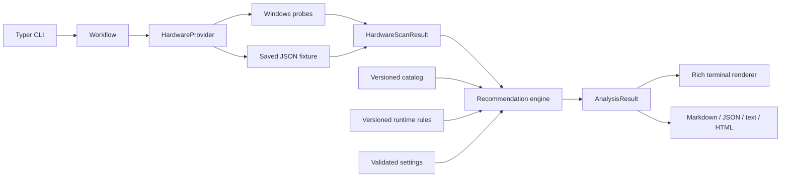
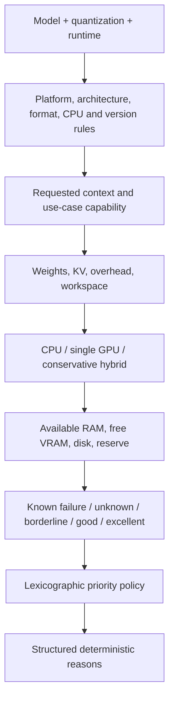
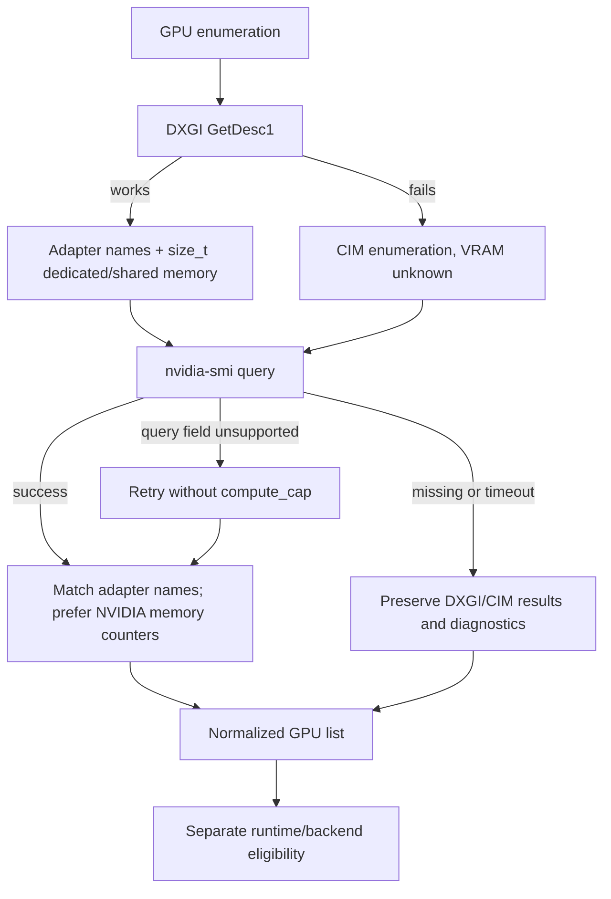

# Architecture

The hardware boundary is `HardwareProvider.scan(progress) -> HardwareScanResult`. The Windows implementation owns every Windows hardware API. A fixture implementation supplies the same typed profile without touching the host. Core analysis accepts validated objects and has no filesystem, network, process or terminal dependencies.

## Modules

- `schemas`: strict versioned Pydantic interfaces, evidence, request, estimates and results.
- `hardware`: provider protocol, fixture import, Windows CIM/DXGI/CPU/RAM/storage/backend probes. Optional probe failures degrade individual fields. Failure of essential physical-memory detection produces exit 4.
- `runtimes`: executable discovery and bounded version probes. Ollama uses local PE version metadata because its CLI version request can consult a daemon.
- `catalog`: resource loading, data validation and reproducibility hashes. JSON resources live inside the Python package and are included in the wheel and frozen executable.
- `recommendation`: memory equations, compatibility predicates, execution planning and ranking. No IO or presentation logic.
- `cli`: context, orchestration, command groups, guided prompts, actual probe progress and human/JSON rendering.
- `reports`: deterministic detailed content, escaping and safe path handling.
- `config`, `logging_config`, `utils`: validated settings, platform folders, rotating logs, bounded process execution and atomic writes.

All result envelopes contain `schema_version`, `application_version` and `generated_at`. `HardwareScanResult.generated_at` is the scan capture timestamp. Recommendation content is deterministic for identical profile/catalog/rules/settings/request; envelope generation timestamps naturally vary. Hashes are SHA-256 of canonical serialized catalog/rules data, not filenames.

Normal commands never make HTTP requests. Maintainer catalog generation consumes checked-in snapshots offline. Model binaries are neither included nor downloaded. External subprocess arguments originate from code-controlled probes; imported scan/catalog strings never become process arguments.

The `main()` entry point calls `multiprocessing.freeze_support()` before the CPU helper path. The CPU probe executes in a bounded subprocess, including in frozen builds, so an unresponsive CPUID library cannot block the scanner indefinitely.

Adding Linux/macOS requires a new provider and explicit platform/runtime policy updates. Existing fixtures and core tests remain usable. Multi-GPU pooling, empirical inference benchmarks and automatic catalog updates are outside this release.
